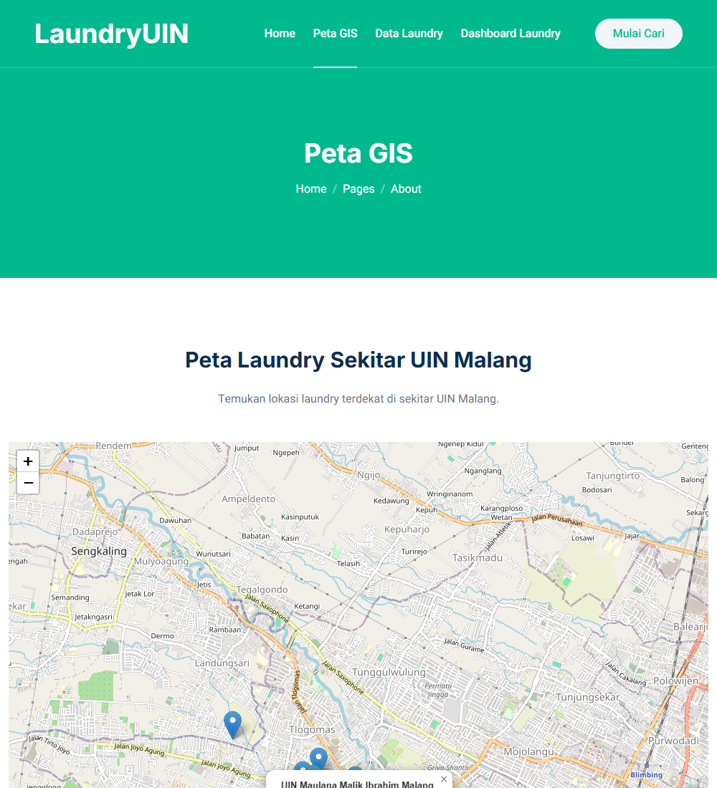

# LaundryGIS — WebGIS for Laundry Services near UIN Malang

A web-based Geographic Information System (WebGIS) that maps and lists laundry services around Universitas Islam Negeri (UIN) Maulana Malik Ibrahim Malang. Originally built on a QGIS/PostGIS/GeoServer/Mapstore stack for a GIS coursework project; now runs standalone in the browser (see **Note on the original backend** below).

[](https://developer.mozilla.org/en-US/docs/Web/HTML)
[](https://sass-lang.com/)
[](https://leafletjs.com/)
[](LICENSE)



## Overview

**Problem.** Students living near UIN Malang need a fast way to find and compare nearby laundry services — including location, price, and turnaround time.

**Solution.** A WebGIS application that visualizes 28 real laundry locations (crawled and geocoded for the original coursework project) on an interactive map, with a searchable data table and a price/speed filter dashboard.

## Features

- **Interactive map** (`peta.html`) — Leaflet map centered on UIN Malang, 28 markers with popups showing name, address, price/kg, and turnaround time
- **Data view** (`data.html`) — searchable table of every laundry service
- **Category dashboard** (`kategori.html`) — filter by price tier (budget/menengah/premium) and turnaround speed (cepat/standar)
- **Feature page** — description of app capabilities
- **Team page** — contributors

## Tech Stack

- **Frontend** — HTML5, SCSS/CSS, vanilla JavaScript
- **Map** — [Leaflet](https://leafletjs.com/) + OpenStreetMap tiles
- **Data** — static JS array (`js/laundry-data.js`), sourced from `Additional Data/LaundryUIN.csv`

## Project Structure

```
LaundryGIS/
├── index.html         # Landing page (includes a map preview)
├── peta.html          # Interactive map view
├── kategori.html      # Price/speed filter dashboard
├── data.html          # Searchable data table
├── feature.html       # Feature description page
├── team.html          # Team page
├── css/               # Compiled CSS
├── scss/              # SCSS source
├── js/
│   ├── laundry-data.js  # The 28 laundry records (name, address, price, turnaround, lat/lng)
│   ├── map.js            # Leaflet map renderer
│   ├── data-table.js     # Searchable table renderer
│   └── kategori.js       # Price/speed filter dashboard renderer
├── lib/                # Third-party libraries
├── img/                # Images and icons
├── docs/               # README screenshot
├── Additional Data/    # Original crawled dataset (CSV) + use-case doc
├── LICENSE
└── README.md
```

## Getting Started

**1. Clone the repo**

```bash
git clone https://github.com/aljuhaeda/LaundryGIS.git
cd LaundryGIS
```

**2. Serve the frontend**

The app is fully static and self-contained — no backend, no build step. Open `index.html` directly, or serve it with any local web server:

```bash
python -m http.server 8000
```

Then open `http://localhost:8000` in a browser. `peta.html`, `data.html`, and `kategori.html` all work immediately.

## Note on the Original Backend

This was originally built as a GIS coursework project on a QGIS → PostgreSQL/PostGIS → GeoServer → Mapstore pipeline, with each page embedding an iframe pointed at `http://localhost:8080/mapstore/...` — a dashboard that only ever existed on the original author's own machine. That meant the repo was non-functional for anyone else who cloned it (including the author, on a different machine).

The map, data table, and filter dashboard have since been rebuilt as self-contained Leaflet/vanilla-JS pages using the same underlying dataset (`Additional Data/LaundryUIN.csv`) that fed the original PostGIS database — so the actual data and results are unchanged, but the site now runs anywhere with no backend to stand up. The original spatial stack is still documented here for reference, since reproducing it is a legitimate (if heavier) way to extend this project — e.g. adding real-time GeoServer-served layers, spatial queries, or multi-user editing that a static page can't do:

- **PostgreSQL** with the **PostGIS** extension
- **GeoServer** — connect to your PostGIS database and publish layers
- **Mapstore** — connect to GeoServer for the dashboard

Import the geospatial data (SHP / GeoJSON, derivable from `Additional Data/LaundryUIN.csv`) into PostGIS via QGIS or `shp2pgsql`.

## License

MIT. See [LICENSE](LICENSE).

## Author

**Zul Iflah Al Juhaeda** — [LinkedIn](https://linkedin.com/in/aljuhaeda) · [GitHub](https://github.com/aljuhaeda)
